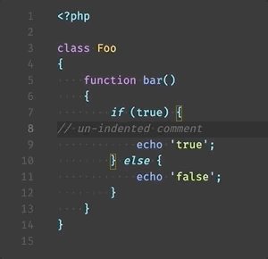
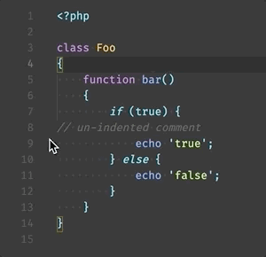

# PHP Code Folding

This is a Visual Studio Code extension for PHP code folding.

## Features

The default PHP code folding is based on indentation. Thus when code is not correctly indented, the code folds in unexpected ways:



With this extension, PHP code are folded based on block scope. So even when some existing code is not correctly indented, the code folds as expected:



## Known Issues

Currently, [heredoc syntax](https://www.php.net/manual/en/language.types.string.php) and [nowdoc syntax](https://www.php.net/manual/en/language.types.string.php) are not supported yet. So folding may be behave unexpectedly if there are braces in them.

-----------------------------------------------------------------------------------------------------------

## Development

```sh
# Run unit tests
npm run unittest
```

* [Getting started - Your first extension](https://code.visualstudio.com/api/get-started/your-first-extension)

### For more information

* [Issue #37494 - php function closure bug after <<<A A; (realy hard to read code without fix)](https://github.com/microsoft/vscode/issues/37494)
* [Issue #3422 - [folding] language-aware folding](https://github.com/microsoft/vscode/issues/3422)
